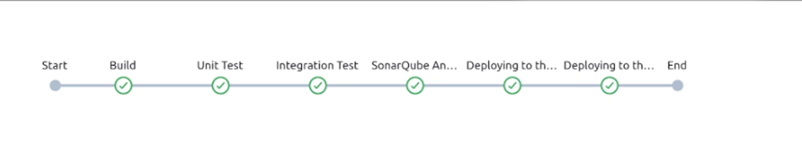
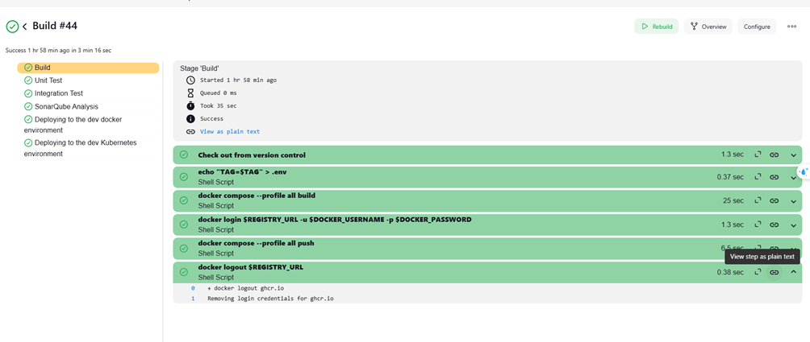
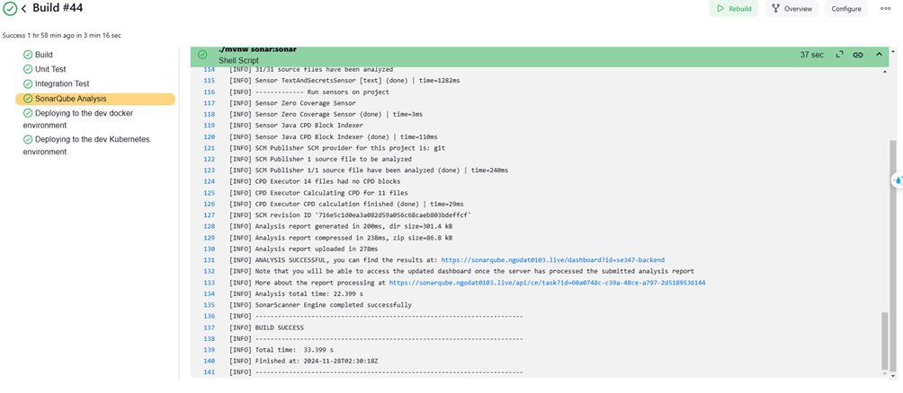
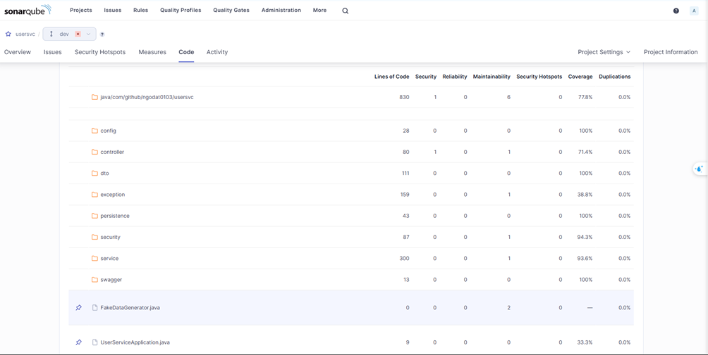
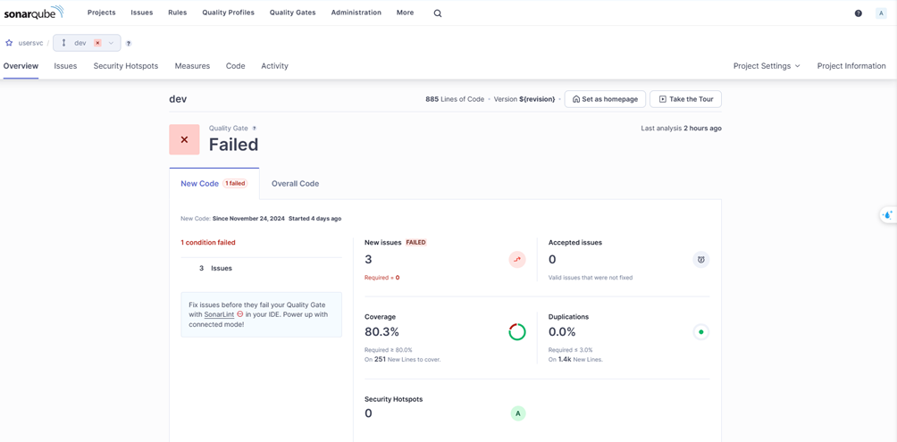

# Demo

**YouTube:** [The Pipeline](https://www.youtube.com/watch?v=_quZB0embzc&feature=youtu.be)

---

## Pipeline Overview

---

---

## Code Analysis

### Code Coverage

### Quality Gate

---

# Conclusion

For detailed insights into the time taken for each Jenkins step, refer to the following document:  
**[Jenkins Step Details](./docs/jenkins-detail-steps.png)**

### Key Highlights:
- **Pipeline Execution Time (with Cache):** Approximately **3 minutes 15 seconds**.
- **Deployment Strategy for Zero Downtime:**
  - **Docker:** Efficiently managed using `docker pull` and `docker up`.
  - **Kubernetes:** Utilizing **blue-green deployment** for seamless transitions.
  - **Helm:** Used for efficient package management.
  - **Secrets Management:** Securely handled using an external **Vault**.

---