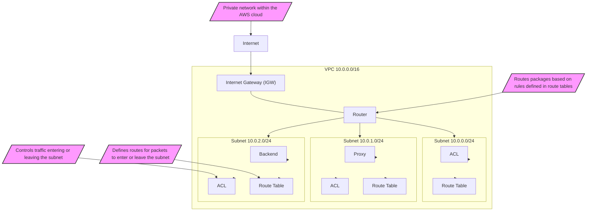

```mermaid
flowchart TD
    %% Nodes %%
    subgraph VPC["VPC 10.0.0.0/16"]
        IGW["Internet Gateway (IGW)"]
        Router["Router"]
        
        subgraph Subnet1["Subnet 10.0.0.0/24"]
            ACL1["ACL"]
            RouteTable1["Route Table"]
        end

        subgraph Subnet2["Subnet 10.0.1.0/24"]
            Proxy["Proxy"]
            ACL2["ACL"]
            RouteTable2["Route Table"]
        end

        subgraph Subnet3["Subnet 10.0.2.0/24"]
            Backend["Backend"]
            ACL3["ACL"]
            RouteTable3["Route Table"]
        end
    end
    
    %% Connections %%
    IGW --- Router
    Router --> Subnet1
    Router --> Subnet2
    Router --> Subnet3
    Subnet1 --> ACL1
    Subnet1 --> RouteTable1
    Subnet2 --> Proxy
    Subnet2 --> ACL2
    Subnet2 --> RouteTable2
    Subnet3 --> Backend
    Subnet3 --> ACL3
    Subnet3 --> RouteTable3
    Internet["Internet"] --> IGW
    
    %% Labels %%
    classDef note fill:#f9f,stroke:#333,stroke-width:2px;
    note1[/"Private network within the AWS cloud"/]:::note --> Internet
    note2[/"Controls traffic entering or leaving the subnet"/]:::note --> ACL3
    note3[/"Defines routes for packets to enter or leave the subnet"/]:::note --> RouteTable3
    note4[/"Routes packages based on rules defined in route tables"/]:::note --> Router

```